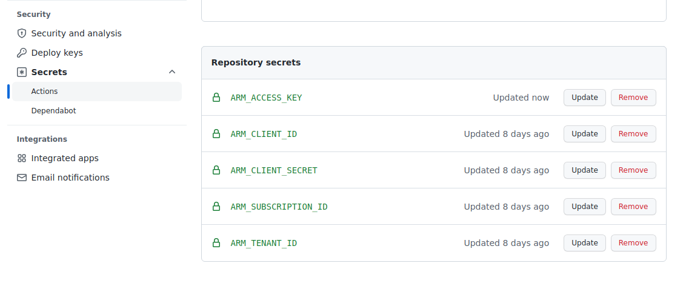

# azure-bootstrap

This repo creates a storage account which is used for bootstrapping your
terraform deployments. It is integrate into **Github Actions** as CI/CD pipline.   
The storage account is later used for saving terraform state files.

## How to use this repo

### Pre-requesites

Make sure you have an azure service principal account. To create one you can use to following command in the azure command line tool.
Replace your-azure-subscription-id with your real Scription ID. Feel free to also adjust the value of the `--name` attribute.\
Otherwise you can configure a service principal using the Azure Portal. Make sure it has `Contributor` role in your Azure subscription.
If your service principal is later used in other repositories and needs to be able to assign **RBAC roles** to Azure resources then it needs the `Owner` role instead of `Contributor`.

```bash
# Login
az login

# Create service principal with Contributor role
az ad sp create-for-rbac \
--name="sp_plyg02" \
--role="Contributor" \
--scope="/subscriptions/your-azure-subscription-id" \
--years=2 \
> az_client_credentials.json
```
### Step 1: Adjust variables

Adjust variables in file [shared_vars.hcl](./shared_vars.hcl) for your Azure environment.
Documentation on each variable is inside the sample file.

```bash
# Edit the file
nano shared_vars.hcl
```
### Step 2: Enter azure credentials in `.env` file

Rename [env.sample](./env.sample) to `.env` and fill in your azure credentials.

### Step 3: Comment out `backend` definition configuration in [provider.tf](./provider.tf) for the initial build

Change in [provider.tf](./provider.tf) from:

```hcl
terraform {
  backend "azurerm" {
  }
}
```

to:

```hcl
// terraform {
//   backend "azurerm" {
//   }
// }
```

This instructs terraform to store tfstate file locally. This is necessary because the storage account does not exist yet.

### Step 4: Run `build_initial.sh`

Before running the script make sure to `source` your `.env` file.  
This script creates the following azure resources:

- resource group
- storage account
- storage container (bucket)

```bash
source .env
./build_initial.sh
```

### Step 5: Migrate terraform state to storage account

Uncomment `backend` configuration in [provider.tf](./provider.tf).

Change:

```hcl
// terraform {
//   backend "azurerm" {
//   }
// }
```

to:

```hcl
terraform {
  backend "azurerm" {
  }
}
```

Goto **[Azure Portal](https://portal.azure.com)** and find your newly create storage account. Goto **Access keys** and klick **Show keys**. Copy the first key and enter it as value for  `ARM_ACCESS_KEY` in your `.env` file.

run:

```bash
source .env
./build.sh
```

The re-runs terraform and terraform will ask you if it should automatically migrate terraform state file. You can happily say **yes**.

### Step 6: Enter Azure credentials into Github

Before pushing your repo changes to Github, make sure to enter your Azure credentials into the `Action secrets` in Github.
Name the `Action secrets` exactly in correspondence to the entries in the `.env` file.



## Destroy

To destroy everything:

```bash
source .env
./destroy.sh
```

This script errors at the end, because the storage account is deleted and terraform tries to access the state file. This is OK.

When you start over again, make sure to delete the following ignored files and folders:

```bash
rm -rf ./.terraform
rm -f ./.terraform.lock.hcl
rm -f ./errored.tfstate
rm -f ./planfile
rm -f ./terraform.tfstate.backup
rm -f ./terraform.tfstate
```

if you would also like to delete the service principal, you can use:

```bash
az ad sp delete --id $ARM_CLIENT_ID
```
